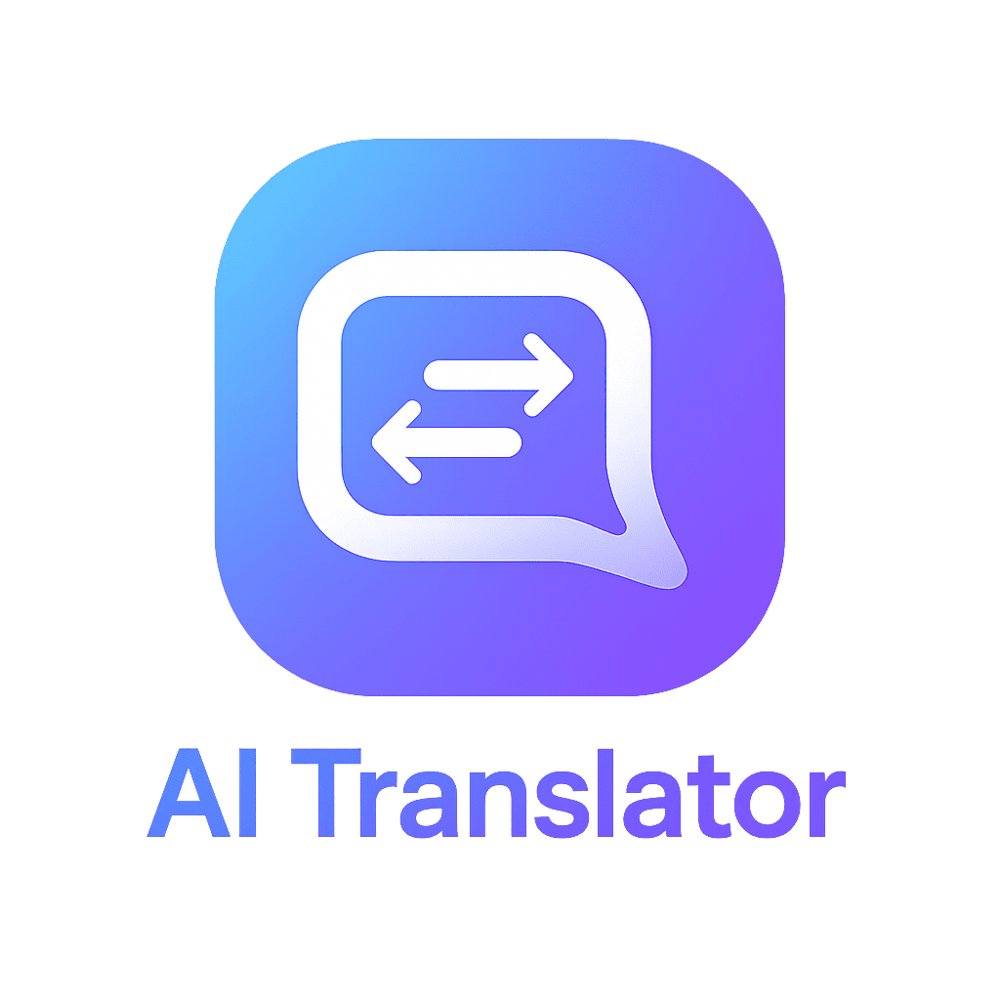

# 🌍 **AI Translator FREE API — Next-Generation Contextual Translation Engine**

Welcome to the **AI Translator API**, a truly **context-aware multilingual translation engine** powered by a next-generation AI model trained on **billions of texts across all languages of the Earth**.

<p align="center">
  🆓 <b>FREE API</b> — use instantly on 
  <a href="https://rapidapi.com/vintarok-vintarok-default/api/advanced-multilanguage-ai-translator-api-with-fast-responses" target="_blank"><b>RapidAPI</b></a> 🚀
</p>

<p align="center">
  <a href="https://rapidapi.com/vintarok-vintarok-default/api/advanced-multilanguage-ai-translator-api-with-fast-responses">
    
  </a>
</p>

Unlike conventional machine translators that rely on rigid phrase-matching and statistical templates, this API leverages deep linguistic intelligence to produce **natural, idiomatic, and culturally accurate translations** — indistinguishable from those written by native speakers.

---

## 🚀 **Why Choose the AI Translator API?**

### 🧠 **Context-Aware Intelligence**
Traditional translation systems often fail when the meaning depends on tone, nuance, or cultural context. Our AI doesn’t just replace words — it **understands the context**. Whether you’re translating literary works, technical documentation, chat messages, or marketing content, it maintains accuracy and style.

### 💬 **Native-Like Output**
The API produces translations that use **native phraseology, syntax, and grammar**, making the text sound as if it were **originally written by a fluent local speaker**.

&gt; Example: Instead of literal word-for-word translations, our system uses regional idioms, professional tone, and cultural references relevant to your target audience.

### 🌐 **Global Language Coverage**
Supports **100+ major and regional languages**, including English, Spanish, Russian, Chinese, Japanese, Arabic, Hindi, Portuguese, French, German, Italian, Korean, Polish, Turkish, and many more. You can even add or test rare languages dynamically — the model adapts instantly.

### ⚙️ **Developer-Friendly JSON Interface**
Input and output are fully JSON-based for seamless integration with any platform or programming language.

```json
{
  "text": "Happy New Year!",
  "target": "russian"
}
```

Response:
```json
{
  "ok": true,
  "source": "auto",
  "target": "russian",
  "translation": "С Новым годом!"
}
```

---

## ⚡ **Performance & Limits**

Each request supports up to **1,000 input characters**.
Translations are processed in real-time with minimal latency thanks to optimized cloud infrastructure.

---

## 🔒 **Quality, Safety & Moderation**
All requests are moderated for policy compliance, ensuring the API is safe for commercial and educational applications. The moderation layer filters harmful, explicit, or policy-violating content before translation.

---

## 💡 **Use Cases**
- 🌏 Multilingual content localization
- 💬 Chatbots and virtual assistants
- 📚 Educational or learning platforms
- 📰 News and publishing translations
- 🏢 Global e-commerce descriptions
- 🎬 Subtitles and media captions
- ✍️ Creative writing and marketing adaptation

---

## 🔧 **Key Features**
- **Auto-detection** of source language
- **Native-accurate grammar & tone**
- **Contextual meaning preservation**
- **Localized punctuation & measurements**
- **JSON schema validation for structured output**
- **Instant global scalability**

---

## 💎 **Why Developers Love It**
- Zero setup — ready-to-use endpoint
- Predictable, clean JSON schema
- Works with any backend or frontend stack
- Contextual, human-grade translations — instantly

&gt; Stop translating — start communicating naturally in every language.

---

## 📈 **Summary**
- **Context-aware** and **AI-native** translation engine
- **Human-like quality**, not robotic literalism
- **Global coverage** of 60+ languages
- **Up to 1,000 characters per request** (scales to millions monthly)
- **Instant JSON API** — plug and play in minutes

---

### 🌟 **Experience translations that think — not just translate.**
Start building global, human-quality multilingual experiences today with the **AI Translator API**.

---

# 🚀 **AI Translator API — Empowering Your API Journey!** 🌟

Welcome to the **AI Translator API**, your gateway to truly **intelligent, context-aware multilingual translation**. This README is designed to help you unlock the full potential of your API experience on the RapidAPI Hub.

---

## 🌍 **What Makes This API Different**

Unlike traditional translation tools that rely on static dictionaries or phrase matching, **AI Translator API** leverages a next-generation model trained on **billions of multilingual texts from across the globe**. It doesn’t just translate — it *understands*.

### ✅ **Key Highlights:**
- Context-aware translations that capture **tone, emotion, and cultural nuance**.
- Outputs that use **native syntax, idioms, and phraseology** — your users will feel like it was written by a local.
- Supports **100+ languages**, with automatic detection of source language.
- Built for developers — clean, fast, structured **JSON** responses.
- Optimized for production: reliable, scalable, and low-latency.

---

## 💬 **Endpoint Overview**

### 🔹 POST `/translate.php`
Perform a high-precision translation with minimal input.

**Request Body (JSON):**
```json
{
  "text": "Good morning!",
  "target": "Spanish"
}
```

**Optional:**
Add `"source": "English"` to specify the source language (otherwise auto-detected).

**Response:**
```json
{
  "ok": true,
  "source": "English",
  "target": "Spanish",
  "translation": "¡Buenos días!"
}
```

---

## ⚡ **Usage Limits & Plans**
Each request supports up to **1,000 input characters**.  
This means:
- **1,000 requests** = up to **1,000,000 characters**
- **5,000 requests** = up to **5,000,000 characters**
- **15,000 requests** = up to **15,000,000 characters**

Built for developers who scale — from solo projects to enterprise-grade apps.

---

## 🧠 **How It Works**
1. **Submit text** and specify your target language.  
2. The model analyzes not just words, but **context, tone, and intent**.  
3. You get a **fluent, native-quality** translation — idiomatic, expressive, and human-like.

The AI is trained on global linguistic data covering diverse domains — from literature to business, from science to everyday conversation.

---

## 🔒 **Security & Compliance**
- All inputs are screened by **content moderation** for policy compliance.  
- No persistent storage of user texts — privacy-first by design.

---

## 💡 **Perfect For:**
- 🌏 Multilingual websites & apps
- 🧑‍💼 Business communication tools
- 🧠 Educational & learning platforms
- 🤖 Chatbots & assistants
- 📰 Media, journalism, and publishing

---

## 📘 **Why Developers Love It**
- ⚙️ **Instant setup:** No configuration, no SDKs — just one endpoint.  
- 🧠 **Smarter translations:** Context-aware and stylistically fluent.  
- 🔄 **Consistent structure:** Clean JSON schema for seamless integration.  
- 🌐 **Scalable & global:** Handle millions of characters easily.

&gt; **Translate like a human, automate like a machine.**  
Bring natural language understanding to your projects today.

---

### ✨ **Empowering Your API Journey**
A great README helps developers explore, understand, and appreciate your work. Use this document as your roadmap — your key to creating applications that communicate naturally across every language barrier.


